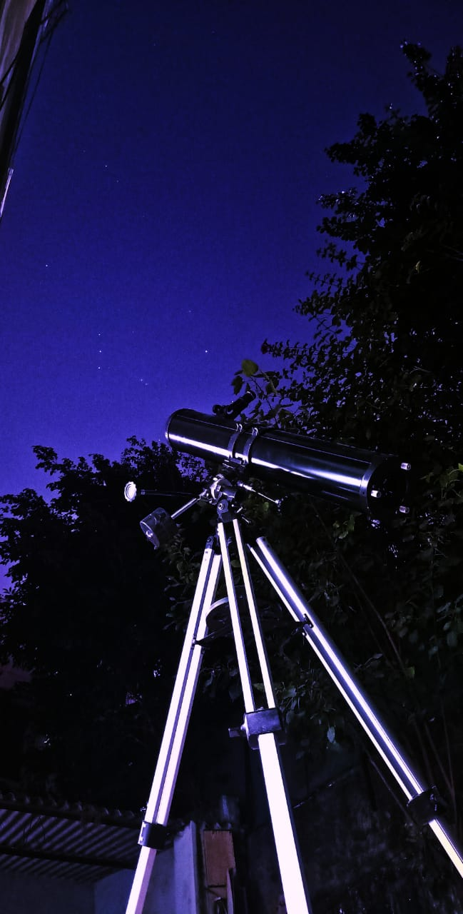

# Counting_Stars

Do you want to count how many stars there are in the sky, download this repo, take a photo of a stary sky and run it on jupyter notebook.
Enjoy the stars , light is the enemy. ;D

